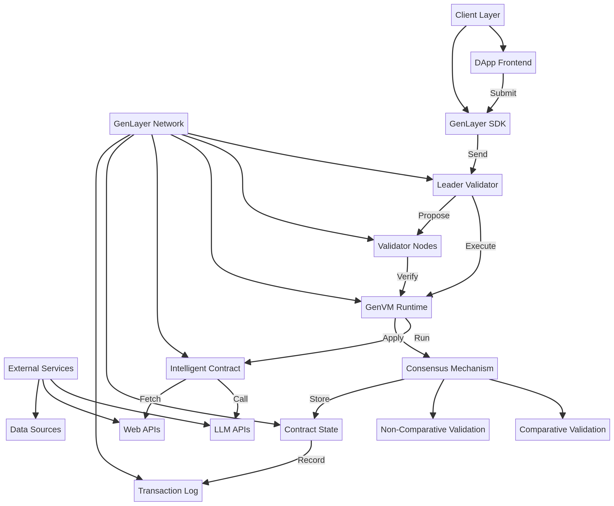
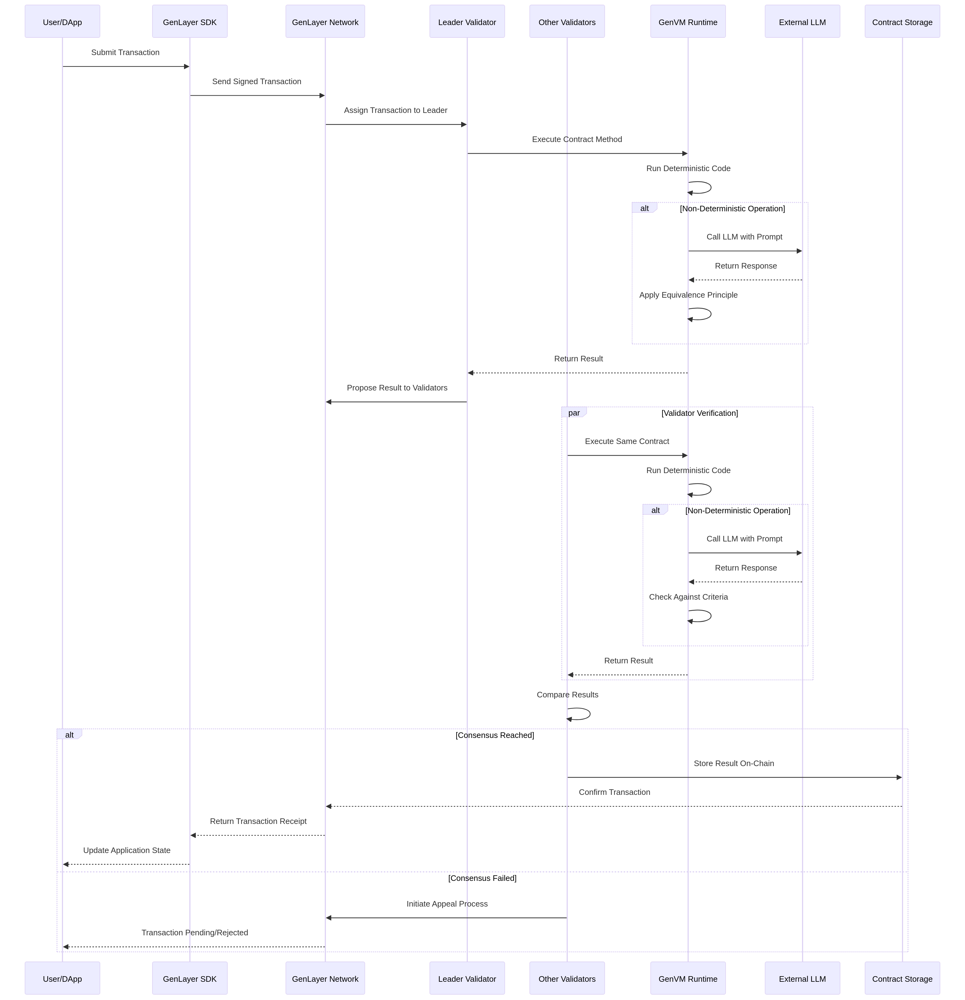
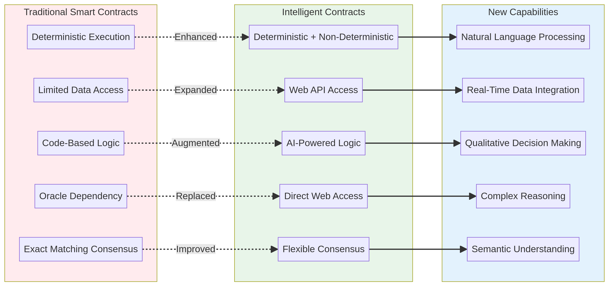

# GenLayer Architecture: Visual Guide

## System Architecture Overview

The following diagram illustrates the complete architecture of GenLayer Intelligent Contracts:



### Key Components

#### Client Layer
- **DApp Frontend:** The user-facing decentralized application interface
- **GenLayer SDK:** JavaScript or Python SDK for interacting with the network

#### GenLayer Network
- **Leader Validator:** Selected validator responsible for executing transactions
- **Validator Nodes:** Multiple validators that verify and reach consensus
- **GenVM Runtime:** Python execution environment for running contracts
- **Intelligent Contract:** The actual contract code written in Python
- **Contract State:** On-chain storage of contract data
- **Transaction Log:** Immutable record of all transactions

#### External Services
- **LLM APIs:** Integration with Large Language Models
- **Web APIs:** Access to real-time external data
- **Data Sources:** Various external data providers

#### Consensus Mechanism
- **Comparative Validation:** For deterministic operations requiring exact matching
- **Non-Comparative Validation:** For AI-driven operations using criteria-based evaluation

## Transaction Execution Flow

The following sequence diagram shows how a transaction is processed:



### Step-by-Step Process

1. **Transaction Submission:** User submits a transaction through the DApp
2. **SDK Processing:** The GenLayer SDK signs and sends the transaction to the network
3. **Leader Assignment:** The network assigns a leader validator to execute the transaction
4. **Contract Execution:** The leader executes the contract method in GenVM
5. **Non-Deterministic Operations:** If the contract calls LLM or web APIs, these operations occur
6. **Result Proposal:** The leader proposes the result to other validators
7. **Validator Verification:** Other validators execute the same contract independently
8. **Consensus Check:** Results are compared or evaluated against criteria
9. **Storage:** Upon consensus, results are stored on-chain
10. **Confirmation:** Transaction receipt is returned to the user

## Comparative vs. Non-Comparative Validation

### Comparative Validation (Strict Equivalence)

**Use Case:** Boolean checks, deterministic computations

```
Leader Result: True
Validator 1 Result: True
Validator 2 Result: True
Validator 3 Result: True

Consensus: REACHED ✓
```

**Process:**
- All validators must produce identical results
- Used for operations with deterministic outputs
- Example: Checking if a website contains specific text

### Non-Comparative Validation (Criteria-Based)

**Use Case:** LLM outputs, text analysis

```
Leader Response: "The content quality is low due to poor grammar"
Validator 1 Response: "Low quality content with grammatical errors"
Validator 2 Response: "Quality rating: LOW - grammar issues present"

Criteria: "Response must classify quality as 'low', 'medium', or 'high'"

All responses meet criteria: CONSENSUS REACHED ✓
```

**Process:**
- Validators evaluate whether results meet specified criteria
- Different responses are acceptable as long as they meet criteria
- Used for AI-driven operations with variable outputs

## Traditional vs. Intelligent Contracts

The following diagram compares traditional smart contracts with Intelligent Contracts:



### Key Differences

| Aspect | Traditional Smart Contracts | Intelligent Contracts |
|--------|---------------------------|----------------------|
| **Execution** | Strictly deterministic | Deterministic + Non-deterministic |
| **Data Access** | Limited, oracle-dependent | Direct web API access |
| **Logic** | Code-based only | AI-powered and code-based |
| **External Data** | Requires oracle services | Direct integration |
| **Consensus** | Exact matching required | Flexible (comparative or criteria-based) |
| **Decision Making** | Binary/mathematical | Qualitative and complex |
| **Language** | Solidity, Vyper | Python |

## Data Flow in Intelligent Contracts

### Reading Data from Web APIs

```
Contract Code
    ↓
gl.nondet.web.get(url)
    ↓
Fetch from External API
    ↓
Return Data to Contract
    ↓
Process Data
    ↓
Store Result
```

### Calling Large Language Models

```
Contract Code
    ↓
gl.eq_principle.prompt_non_comparative(prompt, task, criteria)
    ↓
Call LLM with Prompt
    ↓
LLM Returns Response
    ↓
Validators Check Against Criteria
    ↓
Consensus Decision
    ↓
Store Result
```

## Validator Consensus Process

### Scenario: Comparative Validation (Boolean)

```
┌─────────────────────────────────────────┐
│ Transaction: Verify Website Content     │
└─────────────────────────────────────────┘
         ↓
┌─────────────────────────────────────────┐
│ Leader Validator                        │
│ Fetches: https://example.com            │
│ Checks: Contains "iana"?                │
│ Result: True                            │
└─────────────────────────────────────────┘
         ↓
┌─────────────────────────────────────────┐
│ Validator 1                             │
│ Fetches: https://example.com            │
│ Checks: Contains "iana"?                │
│ Result: True ✓                          │
└─────────────────────────────────────────┘
         ↓
┌─────────────────────────────────────────┐
│ Validator 2                             │
│ Fetches: https://example.com            │
│ Checks: Contains "iana"?                │
│ Result: True ✓                          │
└─────────────────────────────────────────┘
         ↓
┌─────────────────────────────────────────┐
│ All Results Match: CONSENSUS REACHED    │
│ Transaction Finalized                   │
└─────────────────────────────────────────┘
```

### Scenario: Non-Comparative Validation (LLM)

```
┌─────────────────────────────────────────┐
│ Transaction: Analyze Content Quality    │
└─────────────────────────────────────────┘
         ↓
┌─────────────────────────────────────────┐
│ Leader Validator                        │
│ Calls LLM: "Analyze content quality"    │
│ Response: "This content is high quality"│
└─────────────────────────────────────────┘
         ↓
┌─────────────────────────────────────────┐
│ Validator 1                             │
│ Calls LLM: "Analyze content quality"    │
│ Response: "High quality content"        │
│ Check Criteria: "Must rate as high/med" │
│ Result: ✓ Meets Criteria                │
└─────────────────────────────────────────┘
         ↓
┌─────────────────────────────────────────┐
│ Validator 2                             │
│ Calls LLM: "Analyze content quality"    │
│ Response: "Quality rating: HIGH"        │
│ Check Criteria: "Must rate as high/med" │
│ Result: ✓ Meets Criteria                │
└─────────────────────────────────────────┘
         ↓
┌─────────────────────────────────────────┐
│ All Results Meet Criteria: CONSENSUS    │
│ Transaction Finalized                   │
└─────────────────────────────────────────┘
```

## Network Topology

GenLayer operates as a decentralized network with the following topology:

```
                    ┌─────────────────┐
                    │   GenLayer      │
                    │   Network       │
                    └────────┬────────┘
                             │
        ┌────────────────────┼────────────────────┐
        │                    │                    │
    ┌───▼───┐            ┌───▼───┐           ┌───▼───┐
    │Validator│           │Validator│           │Validator│
    │Node 1  │           │Node 2  │           │Node 3  │
    └────────┘           └────────┘           └────────┘
        │                    │                    │
        └────────────────────┼────────────────────┘
                             │
                    ┌────────▼────────┐
                    │  Contract State │
                    │   Storage       │
                    └─────────────────┘
```

## Security Model

GenLayer implements multiple security layers:

### 1. Cryptographic Signing
- All transactions are cryptographically signed
- Prevents unauthorized transaction submission

### 2. Multi-Validator Verification
- Multiple independent validators verify each transaction
- Prevents single point of failure

### 3. Staking and Slashing
- Validators stake cryptocurrency to participate
- Malicious behavior results in stake loss

### 4. Consensus Requirements
- Majority agreement required for transaction finality
- Appeal process for disputed transactions

### 5. Deterministic Execution
- Deterministic code paths produce identical results
- Non-deterministic operations use Equivalence Principle

## Performance Characteristics

### Transaction Processing

| Metric | Value |
|--------|-------|
| Average Block Time | ~5 seconds |
| Transactions per Second | 100+ TPS |
| Finality Time | ~30 seconds |
| Validator Count | 50+ |

### Computational Requirements

| Component | Requirement |
|-----------|-------------|
| GenVM Memory | ~512 MB per contract |
| LLM API Calls | Rate-limited per contract |
| Web API Calls | Rate-limited per contract |
| Storage | Unlimited on-chain |

## Conclusion

GenLayer's architecture combines the security of blockchain with the intelligence of AI and real-time data access. The Equivalence Principle enables consensus on non-deterministic operations, while the multi-validator system ensures security and decentralization.

Understanding this architecture is crucial for developing effective Intelligent Contracts that leverage GenLayer's unique capabilities.

---

**Last Updated:** March 2026  
**Author:** kuru  
**Version:** 1.0
